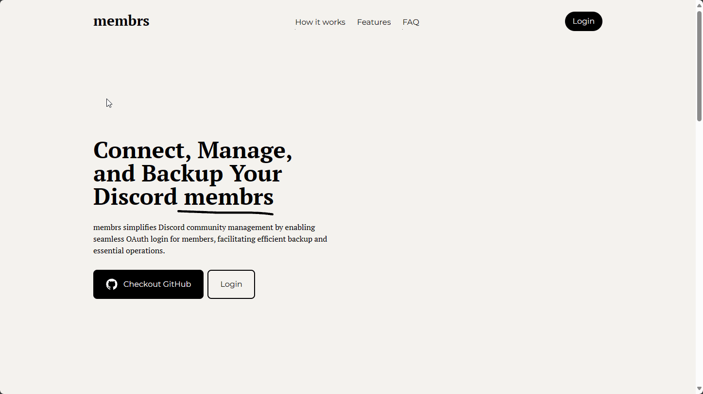

# membrs

selfhosted oauth discord bot for managing discord members

you can find the detailed readmes in the project folders



to set up the latest release, you can use the executable from the GitHub Release page

the installer currently only supports linux

to download and directly run it, you can use:

```shell
curl -O https://github.com/arteiii/membrs/releases/latest/download/membrs && chmod +x membrs && sudo ./membrs
```

## License

this project is licensed under the AGPL v3 license

see more in the [License file](LICENSE-AGPL-3).
